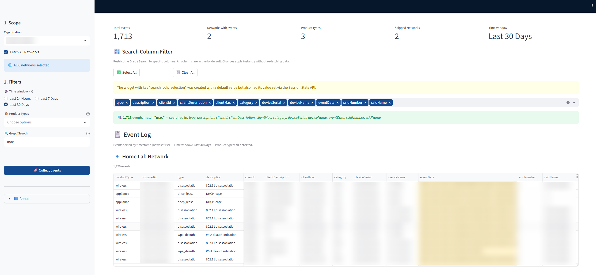

# Meraki Event Log Collector 📋

A comprehensive, interactive dashboard for collecting, searching, and analyzing Meraki event logs across one or more networks. Built with **Streamlit**, **Pandas**, and the **Meraki Dashboard API**, this tool provides a unified, searchable table for all your network events.

---

## ⚠️ Use at Your Own Risk

This is an open-source project and should be treated as-is:
*   **Compliance**: Ensure you comply with your organization's policies and Cisco/Meraki API usage rules.
*   **Security**: Do not share or commit API keys. The application securely reads the `MK_CSM_KEY` from your environment variables.
*   **API Limits**: Large scopes (many networks and/or large time windows) can trigger API rate-limits or take a long time to collect logs.
*   **Least Privilege**: The app uses Dashboard "GET" endpoints (read operations). It works perfectly with a **Read-Only** Meraki API key.

---

## 📁 Project Structure

```text
meraki_log_collector/
├── .streamlit/
│   └── config.toml       # Streamlit theme and server configuration
├── core/
│   ├── __init__.py
│   ├── api.py            # Singleton session management for Meraki SDK
│   └── logger.py         # Rich logging configuration (Console + File)
├── application.log       # Runtime logs (auto-generated)
├── LICENSE               # MIT License file
├── logic.py              # Backend logic, API calls, caching, and data processing
├── README.md             # Project documentation
├── requirements.txt      # Python dependencies
└── web.py                # Frontend UI, layout, and visualization
```

---

## ✨ Key Features

*   **Multi-Network Collection**: Choose specific networks or use "Fetch All Networks" to aggregate logs across an entire organization.
*   **Smart Filtering**: 
    *   Filter by Time Window (Last 24 Hours, 7 Days, or 30 Days).
    *   Filter by specific Meraki Product Types (Wireless, Switch, Appliance, etc.).
*   **Advanced Search & Grep**: Case-insensitive search applied across flattened `eventData`. Dynamically restrict which columns are searched without re-fetching data.
*   **Data Export**: Download your filtered, aggregated event logs as a clean CSV file.
*   **Smart Caching**: Optimized API usage with configurable short and long-term caching to prevent rate-limiting.
*   **Built-in Diagnostics**: View application logs, system configurations, and caching rules directly from UI modal dialogs.


---

## 🚀 Getting Started

### 1. Prerequisites
*   Python 3.9 or higher.
*   A Cisco Meraki API Key (Read-Only privilege is sufficient and recommended).

### 2. Installation
Clone the repository and install the required dependencies:

```bash
pip install -r requirements.txt
```

### 3. Environment Configuration
The application requires your Meraki API key to be set as an environment variable for security.

*   **Windows (PowerShell)**:
    ```powershell
    $env:MK_CSM_KEY = "your_api_key_here"
    ```
*   **Mac/Linux**:
    ```bash
    export MK_CSM_KEY="your_api_key_here"
    ```

### 4. Launching the App
Run the application using Streamlit:

```bash
streamlit run web.py
```

---

## 🖥️ How to Use (UI Walkthrough)

After launching the application, use the sidebar to configure your log collection:

1.  **Scope**:
    *   Select an **Organization**.
    *   Select your target networks via the **Select Network(s)** dropdown, or toggle **Fetch All Networks** to select everything in the organization.
2.  **Filters**:
    *   **Time Window**: Choose how far back to fetch events. Pagination stops automatically once events fall outside the selected window.
    *   **Product Types** *(Optional)*: Select specific product types. If left empty, the app automatically attempts to fetch all product types available/assumed for each network.
    *   **Grep / Search**: Enter a keyword to filter the results. This is applied *after* collection.
3.  **Collect Events**:
    *   Click the **🚀 Collect Events** button. A progress bar will update as the app queries each network and product type.
    *   *Note on Collection Time*: Time depends on the number of networks, product types, event volume, and Meraki API rate limits.

---

## ⚙️ Customization & Configuration

You can adjust system behavior by modifying constants in the source code.

### Caching Timers (`logic.py`)
The app uses Streamlit's `st.cache_data` to cache API responses and reduce repeated calls. You can view current caching timers in the UI under **⚙️ System Configuration**.

To change these values, edit the `CACHE_CONFIG` dictionary in `logic.py`:
```python
CACHE_CONFIG = {
    'short': 300,    # 5 minutes: Used for network events
    'medium': 3600,  # 1 hour
    'long': 86400    # 24 hours: Used for Org and Network lists
}
```
*Note: Restart the Streamlit app for new TTL values to take effect.*

### Product Types (`logic.py`)
The application queries the following product types by default:
`wireless`, `appliance`, `switch`, `systemsManager`, `camera`, `cellularGateway`, `wirelessController`, `campusGateway`, `secureConnect`.

If a network does not expose `productTypes` in the API response, the app falls back to attempting all configured product types for that network.

### Logging (`core/logger.py`)
*   **Console Logging**: Enabled by default using `Rich` for color-coded output.
*   **File Logging**: Defaults to `application.log`. To disable, set `ENABLE_FILE_LOGGING = False` in `core/logger.py`.

---

## 🔍 Search / Grep Behavior

*   **Case-Insensitive**: The search function ignores case.
*   **Flattened Data**: The `eventData` JSON payload is flattened into a searchable string format.
*   **Column Targeting**: Use the **🎛️ Search Column Filter** in the main UI to restrict which columns are searched.
*   **Excluded Columns**: Some metadata fields (like `occurredAt`, `networkName`, `networkId`, `productType`) are intentionally excluded from the search-column picker to keep results meaningful.

---

## 🔌 Meraki API Calls Reference

This application uses the following Meraki Dashboard API endpoints via the official Python SDK. 

*   **getOrganizations**
    *   Used to populate the Organization dropdown.
    *   [API Documentation](https://developer.cisco.com/meraki/api-v1/#!get-organizations)
*   **getOrganizationNetworks**
    *   Used to populate the Networks multiselect.
    *   [API Documentation](https://developer.cisco.com/meraki/api-v1/#!get-organization-networks)
*   **getNetworkEvents**
    *   The core engine for fetching logs. Uses `perPage=1000` and paginates via the `startingAfter` token, stopping once an event's `occurredAt` is older than the user's selected cutoff.
    *   [API Documentation](https://developer.cisco.com/meraki/api-v1/#!get-network-events)

---

## 📝 License

This project is licensed under the **MIT License**. See the `LICENSE` file for details.

**Author**: SandroN